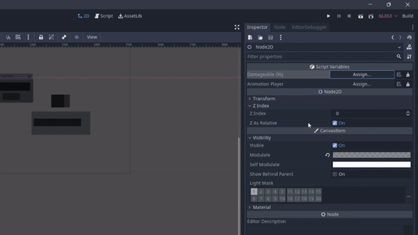
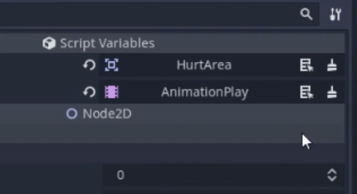
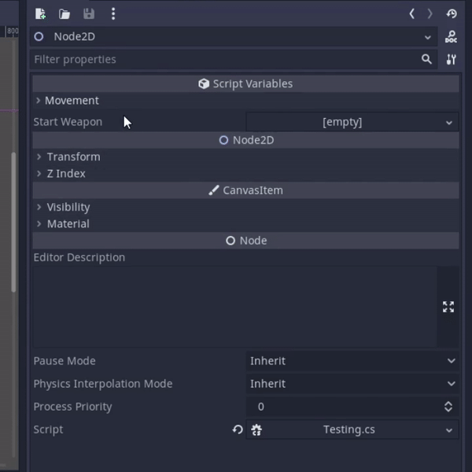

Better inspector godot
=================
> These plugins are mainly for c#

Setup
------------
Just copy the addons folder in your Godot mono project.

Copy this your `ProjectName.csproj` file.
```xml
<ItemGroup>
    <ProjectReference Include="addons/BetterInspector/Quick References/ReferencesGenerator/ReferencesGenerator.csproj" OutputItemType="Analyzer" ReferenceOutputAssembly="false" />
    <Compile Remove="addons/BetterInspector/Quick References/ReferencesGenerator/**" />
</ItemGroup>
```
And set the `TargetFramework` to `netstandart2.1` or 2.0
```xml
<TargetFramework>netstandard2.1</TargetFramework>
```

In your scripts you want this.
```c#
using BetterInspector;
```

Typed node paths
------------------------------

If you have an exported node path and you want it to point to a specific type of node you can use the `TypedPath(Type)` attribute.
```c#
[Export, TypedPath(typeof(AnimationPlayer))]
private NodePath animPath;
```
You can even use unusual types like interfaces.

It will look like thhis in the inspector.



An extra feature of this is the select button. Click on it and the node where the path is pointing to will get selected.



Quick node refernces
---------------------------

Ita really annoying to write this kind of stuff a million times.

```c#
[Export, TypedPath(typeof(AnimationPlayer))]
private NodePath _animPlayer;

public AnimationPlayer animPlayer;

public override void _Ready()
{
    animPlayer = GetNode<AnimationPlayer>(_animPlayer);
}
```
So i implemented a source code generator that does that stuff automatically for you.\
With it you can just do this instead.

```c#
[NodeRef] public AnimationPlayer animPlayer;
```

This will export a typed node path with the type of the field and assign the field on ready.\
To avoid having a cluddered inspector it will put those 
node paths in a foldout called 'References' unless you don't set the foldout field to something different.
If you don't want it to be in a foldout set it to `""`.
```c#
[Reference(foldout = "")]
```

Foldouts
--------------

In Godot there's no easy or good way to put a field into a foldout in the inspector.

With this addon there are some attributes exactly for that.

You can use the `[StartFoldout(string name)]` in combination with the `[EndFoldout]` attribute to define that a range of exported properties is in an foldout.

There's also the `[InFoldout(string name)]` attribute that puts just the property applied on in a foldout.


Example:
```c#
[Export, StartFoldout("Movement")] private float groundedSpeed;      // Is in the foldout
[Export] private float airSpeed;                                     // Also is in the foldout
[Export] private float jumpHeight;                                   // Also is in the foldout
[Export, EndFoldout] private bool canCrouch;                         // Is the last entry of the foldout

[Export] private Weapon startWeapon;                                 // Is not in any foldouts

[Export, InFoldout("Movement")] private bool allowJump, allowSprint; // Both fields will be in the movement foldout
```



The foldout will be created at the position where the first property made it in via `[StartFoldout(string name)]` or `[InFoldout(string name)]` but you  may want the foldout to be always at the bottom or the top.\
To do that you can give the attribute where the fouldout gets created a additional parameter called position.
```c#
[StartFoldout("Movement", position = FoldoutPosition.Bottom)]
```
Now the foldout will be at the bottom (under startWeapon in this example).

You can also start and end a foldout by giving properties special names (Mainly for GDScript)
```gd
export var _StartF_AtBottom_Movement
export var groundedSpeed : float
export var airSpeed : float
export var jumpHeight : float
export var canCrouch : bool
export var _EndF_Movement

export var startWeapon : Weapon
```
